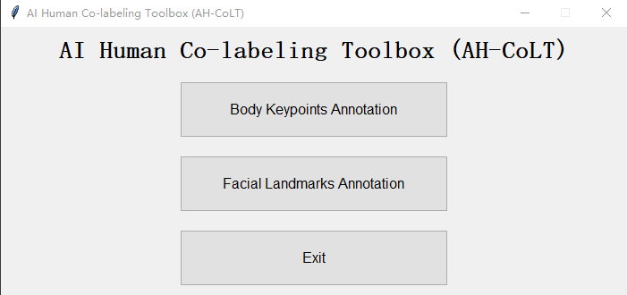
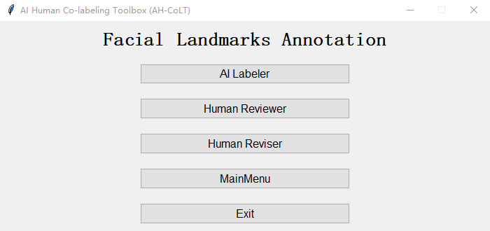

# AI Human Co-Labeling Toolbox (AH-CoLT) 

The goal of the AH-CoLT is to provide an efficient and augmentative annotation tool to facilitate creating large labeled visual datasets.
This toolbox presents an efficient semi-automatic groundtruth generation framework for unlabeled images/videos. 
AH-CoLT enables accurate groundtruth labeling by incorporating the outcomes of state-of-the-art AI recognizers into a time-efficient human-based review and revise process.

So far, we have integrated different 2D pose inference models into our toolbox:
1. **Hourglass**: Single person 16 keypoints human body pose estimation in MPII fasion.
2. **Faster RCNN**: Single person 17 keypoints human body pose estimation in COCO fashion.
3. **FAN**: Single person 68 facial landmarks estmation based on FAN's face alignment.


Contact: 

[Xiaofei Huang](xhuang@ece.neu.edu),
[Shaotong Zhu](shawnzhu@ece.neu.edu),
[Sarah Ostadabbas](ostadabbas@ece.neu.edu)


## Contents   
*  [Requirements](#requirements)
*  [Function selection](#function-selection)
*  [Body Keypoints Estimation](#body-keypoints-estimation)
    *  [Stage I: AI Labeler](#stage-i-ai-labeler)
    *  [Stage II: Human Reviewer](#stage-ii-human-reviewer)
    *  [Stage III: Human Reviser](#stage-iii-human-reviser)
*  [Facial Landmarks Estimation](#facial-landmarks-estimation)
    *  [Stage I: AI Labeler](#stage-i-ai-labeler)
    *  [Stage II: Human Reviewer](#stage-ii-human-reviewer)
    *  [Stage III: Human Reviser](#stage-iii-human-reviser)
*  [Citation](#citation)
*  [License](#license)
*  [Acknowledgements](#acknowledgements)


## Requirements 
The interface of toolbox is developed by tkinter in python3.7 on Ubuntu 18.04. It also passed the test on Windows10 platform with python3.7 and CPU.

1. Install following libraries:
    *  (1) [pyTorch](https://pytorch.org/)
           
       For Windows
       ```
       pip install torch==1.7.0+cpu torchvision==0.8.1+cpu torchaudio===0.7.0 -f \
       https://download.pytorch.org/whl/torch_stable.html
       ```

       For Ubuntu
       ```
       pip install torch==1.7.0+cu101 torchvision==0.8.1+cu101 torchaudio==0.7.0 -f \
       https://download.pytorch.org/whl/torch_stable.html
       ```

    *  (2) [detectron2](https://github.com/facebookresearch/detectron2/blob/master/INSTALL.md)
           
       For Windows
       ```
       git clone https://github.com/facebookresearch/detectron2.git
       python -m pip install -e detectron2
       ```

       For Ubuntu
       ```
       python -m pip install detectron2 -f \
       https://dl.fbaipublicfiles.com/detectron2/wheels/cpu/torch1.6/index.html
       ```

    *  (3) [face-alignment](https://github.com/1adrianb/face-alignment)
           
       For Windows and Ubuntu
       ```
       pip install face-alignment
       ```
2. Run `pip install -r requirements.txt` to install other libraries.
3. Download one of pretrained models (e.g. [8-stack hourglass model](https://drive.google.com/drive/folders/0B63t5HSgY4SQQ2FBRE5rQ2EzbjQ?usp=sharing)) 
and put the model folder into `./Models/Hourglass/data/mpii`.
4. Download a weights file for YOLOv3 detector [here](https://pjreddie.com/media/files/yolov3.weights), and place it into `./Models/Detection/data`.
5. Download one of COCO Person Keypoint Detection models from [Detectron2 Model Zoo](https://github.com/facebookresearch/detectron2/blob/master/MODEL_ZOO.md).  (e.g. [keypoint_rcnn_R_50_FPN_3x](https://dl.fbaipublicfiles.com/detectron2/COCO-Keypoints/keypoint_rcnn_R_50_FPN_3x/137849621/model_final_a6e10b.pkl), and put the file into `./Models/Detectron2/models`.

## Main Annotation Function Selection
Run `Toolbox.py` to launch main window of AH-CoLT. The first step is to choose the subject of annotation. AH-CoLT provides both facial landmarks annotation and body keypoints annotation function. 
The three stages annotation process,which includes: AI Labeler, Human Reviewer, and Human Reviser, will follow once clicking either function button. For user convenience, each stage can be employed independently.
The task selection window



## Body Keypoints Annotation
The Body Keypoints Annotation is mainly used to annotate the human body area for pose estimation.


### Stage I: AI Labeler
AI labeler interface allows users to load a video or a collection of images as the unlabeled data source 
and select an appropriate already trained model as the initial AI labeler. 
The types of labels outputted by the AI model is then displayed in the textbox.

Model Selection:
* Hourglass: 16 MPII keypoints for single-person images.
* Faster R-CNN: 17 COCO keypoints for single-person images.

The "AI Labeler" window


#### Input
Choose a directory of images set or a file of video. Each image could be .jpeg or .png file. The format of video file could be MP4, AVI or MOV.
##### Example:
```
{ROOT}/img
```
#### Output
1. If resource is a video, the corresponding frames will be generated first in folder `${root}/video_name`, which is named the video file name. 
2. Predicted keypoints of all images/frames will be save in `dirname_model.pkl` under root path. Here `dirname` represents 
the name of images/frames set and `model` is the abbreviation of name of selected model.
##### Example:
```
${ROOT}/img_hg.pkl
```

### Stage II: Human Reviewer
In this stage, the output of the AI labeling is given to a human reviewer for his/her evaluation. Reviewer needs check keypoints in order.

#### Input
1. Folder of images/frames set
2. AI predicted keypoint file, which is generated by AI labeler.
#### Output
When all images have been reviewed, a flag list file will be save in `dirname_flag.pkl` under root path. Here `dirname` represents 
the name of images/frames set.
##### Example:
```
${ROOT}/img_flag.pkl
```
The image reviewing window


The format of labels, which represent the AI predicted keypoints, is `poseindex_keypointindex`. 

| Operation | Description |
| --- | --- |
| Click left button of mouse| Accept current predicted keypoint |
| Click right button of mouse | Reject current predicted keypoint |
| Press 'i' on keyboard | Insert a keypoint |
| Press 'd' on keyboard | Delete current keypoint |
| Press 'u' on keyboard | Undo |
| Press 'y' on keyboard | Confirm reviewing of current image (ONLY work after checking all keypoints)
| Press 'n' on keyboard | Recheck current image |

#####Note:
As we default all keypoints visible, if considering the visibility of each keypoint, please mark obscured keypoints as errors, 
so that they can be annotated as invisible.

### Stage III: Human Reviser
In this stage, only the AI model errors detected by the human reviewer need to be revised.

#### Input
1. Folder of images/frames set
2. AI predicted keypoint file, which is generated by AI labeler.
3. Corresponding flag list file, which is generated by Human Reviewer.
#### Output
When all images have been revised, a groundtruth will be save in `dirname_gt.pkl` under root path. Here `dirname` represents 
the name of images/frames set.
##### Example:
```
${ROOT}/img_gt.pkl
```
The image revising window


The keypoints, which need to be revised, are displayed in red. After correcting all keypoints marked as errors in one image, 
human reviser needs to capture the head bounding box by holding and releasing left button to create a pink rectangle. 

| Operation | Description |
| --- | --- |
| Click left button of mouse| Capture the new position of red keypoint and set as 'visible' |
| Click right button of mouse | Capture the new position of red keypoint and set as 'invisible' |
| Press 'u' on keyboard | Undo |
| Hold and release left button of mouse | Create a rectangle box |
| Press 'y' on keyboard | Confirm revising of current image (ONLY work after revising all keypoints and capturing bounding box)

**Note**: In MPII fashion or for the 68 facial landmarks, the rectangle box is created for head bounding box, while it is for body bounding box in COCO fashion.  

## Facial Landmarks Annotation
The Facial Landmarks Annotation is mainly used to annotate the facial area.



### Stage I: AI Labeler
AI labeler interface allows users to load a video or a collection of images as the unlabeled data source 
and select an appropriate already trained model as the initial AI labeler. 
The types of labels outputted by the AI model is then displayed in the textbox.

Model Selection:
* FAN: 68 facial landmarks for single-person images.

The "AI Labeler" window


#### Input
Choose a directory of images set or a file of video. Each image could be .jpeg or .png file. The format of video file could be MP4, AVI or MOV.
##### Example:
```
{ROOT}/face
```
#### Output
1. If resource is a video, the corresponding frames will be generated first in folder `${root}/video_name`, which is named the video file name. 
2. Predicted keypoints of all images/frames will be save in `dirname_model.pkl` under root path. Here `dirname` represents 
the name of images/frames set and `model` is the abbreviation of name of selected model.
##### Example:
```
${ROOT}/face_fan.pkl
```

### Stage II: Human Reviewer
In this stage, the output of the AI labeling is given to a human reviewer for his/her evaluation. Reviewer needs check keypoints in order.

#### Input
1. Folder of images/frames set
2. AI predicted keypoint file, which is generated by AI labeler.
#### Output
When all images have been reviewed, a flag list file will be save in `dirname_flag.pkl` under root path. Here `dirname` represents 
the name of images/frames set.
##### Example:
```
${ROOT}/face_flag.pkl
```
The image reviewing window


The format of labels, which represent the AI predicted keypoints, is `poseindex_keypointindex`. 

| Operation | Description |
| --- | --- |
| Click left button of mouse| Accept current predicted keypoint |
| Click right button of mouse | Reject current predicted keypoint |
| Press 'i' on keyboard | Insert a keypoint |
| Press 'd' on keyboard | Delete current keypoint |
| Press 'u' on keyboard | Undo |
| Press 'y' on keyboard | Confirm reviewing of current image (ONLY work after checking all keypoints)
| Press 'n' on keyboard | Recheck current image |

#####Note:
As we default all keypoints visible, if considering the visibility of each keypoint, please mark obscured keypoints as errors, 
so that they can be annotated as invisible.

### Stage III: Human Reviser
In this stage, only the AI model errors detected by the human reviewer need to be revised.

#### Input
1. Folder of images/frames set
2. AI predicted keypoint file, which is generated by AI labeler.
3. Corresponding flag list file, which is generated by Human Reviewer.
#### Output
When all images have been revised, a groundtruth will be save in `dirname_gt.pkl` under root path. Here `dirname` represents 
the name of images/frames set.
##### Example:
```
${ROOT}/face_gt.pkl
```
The image revising window


The keypoints, which need to be revised, are displayed in red. After correcting all keypoints marked as errors in one image, 
human reviser needs to capture the head bounding box by holding and releasing left button to create a pink rectangle. 

| Operation | Description |
| --- | --- |
| Click left button of mouse| Capture the new position of red keypoint and set as 'visible' |
| Click right button of mouse | Capture the new position of red keypoint and set as 'invisible' |
| Press 'u' on keyboard | Undo |
| Hold and release left button of mouse | Create a rectangle box |
| Press 'y' on keyboard | Confirm revising of current image (ONLY work after revising all keypoints and capturing bounding box)

**Note**: In MPII fashion or for the 68 facial landmarks, the rectangle box is created for head bounding box, while it is for body bounding box in COCO fashion.  


## Citation 
```BibTeX
@inproceedings{huang2019ah,
  title={AH-CoLT: an AI-Human Co-Labeling Toolbox to Augment Efficient Groundtruth Generation},
  author={Huang, Xiaofei and Rezaei, Behnaz and Ostadabbas, Sarah},
  booktitle={2019 IEEE 29th International Workshop on Machine Learning for Signal Processing (MLSP)},
  pages={1--6},
  year={2019},
  organization={IEEE}
}
```

## License 
* This code is for non-commercial purpose only. 

* For other uses please contact [Augmented Cognition Lab (ACLab)](http://www.northeastern.edu/ostadabbas/) at Northeastern University. 


## Acknowledgements
1. The person detector is brought from [pytorch-yolo-v3](https://github.com/ayooshkathuria/pytorch-yolo-v3), which is based on 
[YOLOv3: An Incremental Improvement](https://pjreddie.com/media/files/papers/YOLOv3.pdf).
2. The hourglass pose estimation for AI Labeler comes from [pytorch-pose](https://github.com/bearpaw/pytorch-pose).
3. The Faster R-CNN pose estimation for AI Labeler comes from [Detectron2](https://github.com/facebookresearch/detectron2)
4. The facial landmarks detector comes from [face-alignment](https://github.com/1adrianb/face-alignment)


